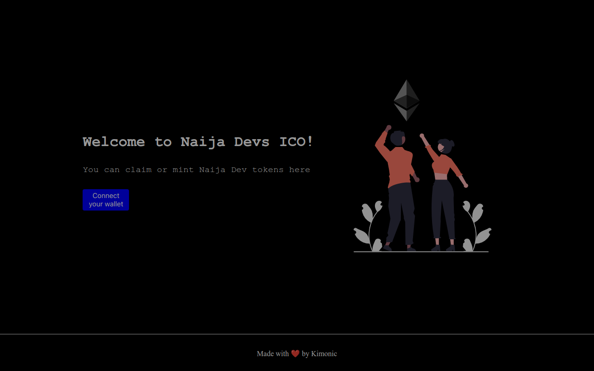

# 💎 Launch your own Initial Coin Offering 

### [LIVE SITE ](https://i-c-o.vercel.app/) ⏩ https://i-c-o.vercel.app/

## Project Description 📝

### Initial Coin Offering (ICO) Project

This project involves the creation of an Initial Coin Offering (ICO) for a cryptocurrency token. It covers the development of the token and the deployment of the token on a blockchain.

## Overview

An Initial Coin Offering (ICO) is a new form of crowdfunding, typically facilitated by cryptocurrency, that allows companies to raise funds for their projects or businesses. ICOs are designed to enable the team behind the project to quickly acquire the capital needed to launch, while allowing investors to purchase the token at a discount to its future market value.

## Development

The first step in the creation of an ICO is to develop the cryptocurrency token itself. This includes designing the token's features, such as its total supply, transferability, and security features, as well as the underlying blockchain protocol. The development of the token was done using Solidity, a programming language specifically designed for building blockchain applications.

## Project Demo 🎥


## Directory Structure 📂
- `hardhat/contracts` ⏩ Smart Contract Code [Deployed @ Goerli Test Network]
- `frontend` ⏩ Project's React frontend.

## Run this project locally 🏃🏾‍♂️💨

```shell
git clone https://github.com/Kimonic99/I-C-O.git
```

### Frontend 🎨🖌

- `cd frontend`
- `npm install` Install Dependencies
- `npm run dev` Start the frontend in localhost 
- Open `http://localhost:3000` <br />
We can use the localhost frontend to interact with the smart contract on Goerli Network

### Backend 🔗

- `cd hardhat`
- `npm install` Install Dependencies
- `npx hardhat --version` Check if Hardhat is properly installed 
- `npx hardhat compile` Compile the Smart Contract
- `npx hardhat test` Test the Smart Contract Locally
- `npx hardhat run scripts/deploy.js` Deploy the Smart Contract Locally


### 💎 ICO Contract Address 💎
[🚀 0x64ea8e6Ad223D4cb5e9E2364Cc9f83ef49d2B19e 🛸](https://goerli.etherscan.io/address/0x64ea8e6Ad223D4cb5e9E2364Cc9f83ef49d2B19e)
